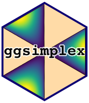

<!-- README.md is generated from README.Rmd. Please edit that file -->

```{r, include = FALSE}
stopifnot(require(knitr))
options(width = 90)
knitr::opts_chunk$set(
  collapse = TRUE,
  comment = "#>",
  fig.path = "man/figures/README-",
  dev = "png",
  dpi = 150,
  fig.asp = 0.8,
  fig.width = 5,
  out.width = "60%",
  fig.align = "center"
)
set.seed(127)
```



# ggsimplex

<!-- badges: start -->
[](https://github.com/marvinschmitt/ggsimplex/actions)
[](https://app.codecov.io/gh/marvinschmitt/ggsimplex?branch=main)
<!-- badges: end -->

The goal of `ggsimplex` is to provide a set of visualization utilities revolving around the simplex as its underlying canvas.
It is an extension to `ggplot2`.
