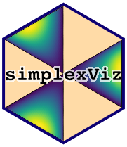

<!-- README.md is generated from README.Rmd. Please edit that file -->

# ggsimplex

<!-- badges: start -->
<!-- badges: end -->

The goal of `ggsimplex` is to provide a set of visualization utilities
revolving around the simplex as its underlying canvas. It is an
extension to `ggplot2`.
